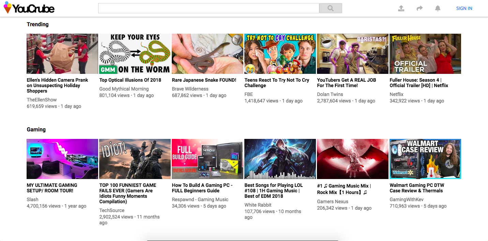
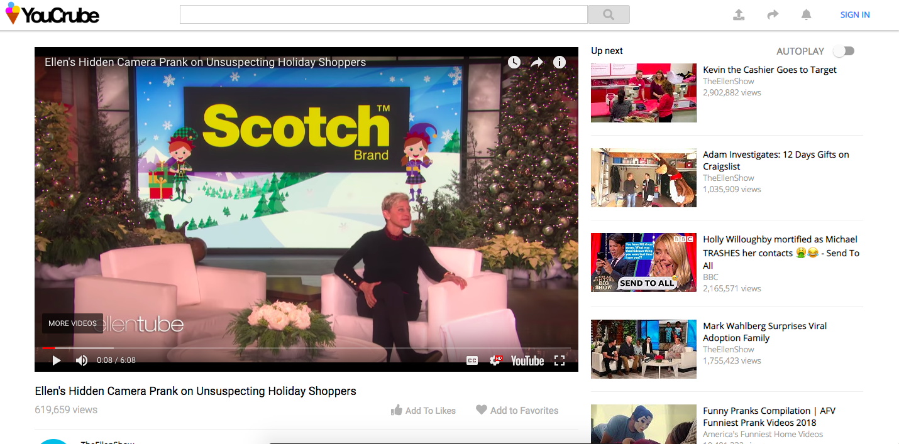
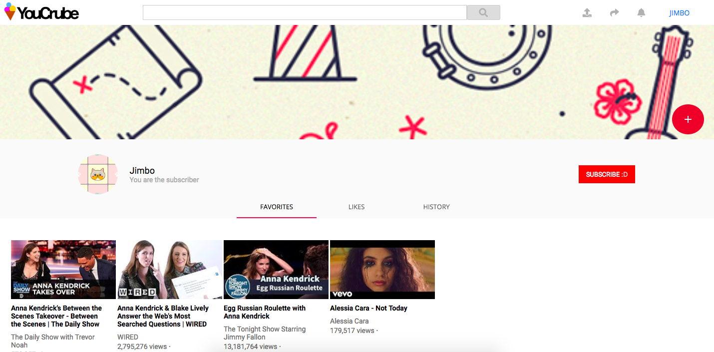

# Youtube Scraper

The goal of this project is to build a full stack application scraping youtubes data.
Though users cannot upload their own videos they can search and view contents of the video as well as 
save and like videos when they create an account.

### View the application [here](https://youcrube.herokuapp.com/)

# Final Product
## Home page

## Video Page

## User page

## Deployment
Heroku
## Built With
* [React Js](https://reactjs.org/) - Front End Tech
* [Node](https://nodejs.org/en/) - Back End Tech
* [MySql](https://www.mysql.com/) - Database
* [Heroku](https://heroku.com) - Host

## Authors

* **Andrew Ty Nguyen** - [Github Repo](https://github.com/andyt-nguyen)
